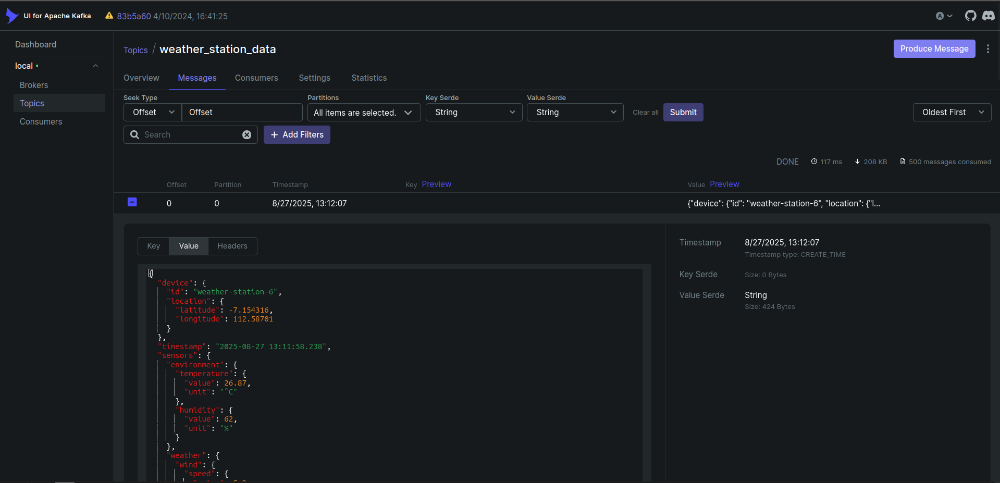

# Apache Kafka 101 - Weather Station Data Pipeline

## Project Structure

```
apache-kafka-101/
├── consumer/
│   ├── src
│   │   ├── data_streamer/
|   │   ├── data_transformer/
│   │   ├── config.py
│   │   └── utils.py
│   ├── Dockerfile
│   ├── main.py
│   └── requirements.txt
├── producer/
│   ├── src
│   │   ├── data_generator/
|   │   ├── data_streamer/
│   │   └── config.py
│   ├── Dockerfile
│   ├── main.py
│   └── requirements.txt
├── init-scripts/
└── docker-compose.yaml
```

## Objective

This pipeline processes weather station sensor data from Surabaya. The transformation included two phases which are flattening and aggregating the data. The flattened data is pushed to another Kafka topic, while the aggregated data is inserted into the database in micro-batches (every 2 minutes).

### Raw Data Sample

```json
{
  "device": {
    "id": "weather-station-6",
    "location": {
      "latitude": -7.154316,
      "longitude": 112.58701
    }
  },
  "timestamp": "2025-08-27 13:11:58.238",
  "sensors": {
    "environment": {
      "temperature": {
        "value": 26.87,
        "unit": "°C"
      },
      "humidity": {
        "value": 62,
        "unit": "%"
      }
    },
    "weather": {
      "wind": {
        "speed": {
          "value": 5.2,
          "unit": "km/h"
        },
        "direction": "West"
      },
      "precipitation": {
        "value": 2.05,
        "unit": "mm"
      },
      "uv_index": {
        "value": 0.71
      }
    }
  }
}
```

### Flattened Data Sample

```json
{
  "device_id": "weather-station-6",
  "latitude": -7.154316,
  "longitude": 112.58701,
  "event_time": "2025-08-27T13:11:58.238+07:00",
  "temperature_value": 26.87,
  "humidity_value": 62,
  "wind_speed_value": 5.2,
  "wind_direction": "West",
  "precipitation_value": 2.05,
  "uv_index": 0.71
}
```

### Aggregated Data Sample

| device_id         | window_start        | window_end          | avg_temperature | min_temperature | max_temperature | avg_humidity | avg_wind_speed | max_uv_index |
| ----------------- | ------------------- | ------------------- | --------------- | --------------- | --------------- | ------------ | -------------- | ------------ |
| weather-station-6 | 2025-08-27 13:10:00 | 2025-08-27 13:12:00 | 26.87           | 26.87           | 26.87           | 62           | 5.2            | 0.71         |

## How to Run

1. Clone the repository.

2. Create `.env` file:

```bash
cp .env.example .env
# Edit .env (you only need change `KAFKA_TOPIC_SOURCE` and `KAFKA_TOPIC_TARGET`)
```

4. Start doker compose:

```bash
docker compose up -d
```

This command will start all services defined in `docker-compose.yaml`, including:

- **producer**: generates dummy data and pushes it to a Kafka topic.
- **consumer**: consumes the dummy data from Kafka, transforms it using Spark, and pushes it to a new Kafka topic and the database.
- **spark-master**: coordinates distributed data processing across Spark workers.
- **spark-worker**: executes the tasks assigned by the Spark master.
- **kafka**: message broker that stores and streams data between producer and consumer.
- **kafka-ui**: kafka web interface to monitor and manage Kafka topics.
- **postgres**: stores the aggregated data.

The producer and consumer will automatically start their processes right after the Docker Compose command is run.

## Results

### Kafka Topic: `weather_station_data` (Store Raw Data)



### Kafka Topic: `weather_station_transformed` (Store Transformed Data)


### Spark Master Web UI


### Database Query Results

```sql
SELECT * FROM weather_sensor_aggregate ORDER BY window_start DESC, device_id LIMIT 12;
```

Output:

| device_id         | window_start        | window_end          | avg_temperature | min_temperature | max_temperature | avg_humidity | avg_wind_speed | max_uv_index |
| ----------------- | ------------------- | ------------------- | --------------- | --------------- | --------------- | ------------ | -------------- | ------------ |
| weather-station-1 | 2025-08-27 13:40:00 | 2025-08-27 13:42:00 | 28.08           | 28.07           | 28.09           | 53           | 7.48           | 0.64         |
| weather-station-2 | 2025-08-27 13:40:00 | 2025-08-27 13:42:00 | 30.29           | 30.27           | 30.30           | 54           | 5.00           | 7.29         |
| weather-station-3 | 2025-08-27 13:40:00 | 2025-08-27 13:42:00 | 31.51           | 31.48           | 31.54           | 49           | 8.51           | 5.11         |
| weather-station-4 | 2025-08-27 13:40:00 | 2025-08-27 13:42:00 | 28.44           | 28.40           | 28.46           | 73           | 9.40           | 0.52         |
| weather-station-5 | 2025-08-27 13:40:00 | 2025-08-27 13:42:00 | 26.32           | 26.30           | 26.36           | 67           | 8.58           | 0.52         |
| weather-station-6 | 2025-08-27 13:40:00 | 2025-08-27 13:42:00 | 27.02           | 27.00           | 27.04           | 61           | 5.16           | 0.76         |
| weather-station-1 | 2025-08-27 13:38:00 | 2025-08-27 13:40:00 | 28.06           | 28.05           | 28.08           | 53           | 7.51           | 0.63         |
| weather-station-2 | 2025-08-27 13:38:00 | 2025-08-27 13:40:00 | 30.28           | 30.26           | 30.30           | 56           | 5.02           | 7.30         |
| weather-station-3 | 2025-08-27 13:38:00 | 2025-08-27 13:40:00 | 31.51           | 31.47           | 31.55           | 48           | 8.52           | 5.12         |
| weather-station-4 | 2025-08-27 13:38:00 | 2025-08-27 13:40:00 | 28.45           | 28.43           | 28.48           | 73           | 9.40           | 0.54         |
| weather-station-5 | 2025-08-27 13:38:00 | 2025-08-27 13:40:00 | 26.32           | 26.30           | 26.35           | 67           | 8.54           | 0.54         |
| weather-station-6 | 2025-08-27 13:38:00 | 2025-08-27 13:40:00 | 26.98           | 26.97           | 26.99           | 62           | 5.16           | 0.79         |
